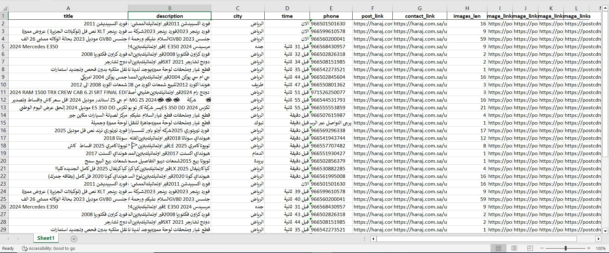
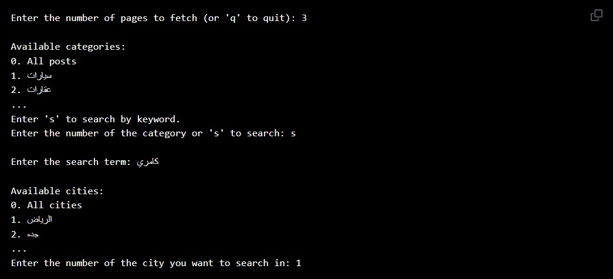

#  Haraj Saudi Web Scraper

A Python-based web scraper to extract classified listings and ads from [Haraj.com.sa](https://haraj.com.sa) — the largest Saudi Arabia classifieds platform. Supports category browsing, keyword search, city filtering, multi-page scraping, and automated phone number extraction via Selenium.



---

## 📋 Table of Contents

- [About](#about)
- [Features](#features)
- [How It Works](#how-it-works)
- [Data Extracted](#data-extracted)
- [Requirements](#requirements)
- [Installation](#installation)
- [Usage](#usage)
- [Output](#output)
- [Project Structure](#project-structure)
- [Notes](#notes)
- [License](#license)

---

## 📖 About

This project automates the extraction of classified listings from Haraj.com.sa using:
- **`requests` + `BeautifulSoup`** for fast static page parsing
- **`Selenium`** for dynamic interactions (login, revealing hidden phone numbers)
- **`Pandas`** to structure and export data to Excel

---

## ✨ Features

- ✅ Browse and select from all available **categories** on Haraj
- ✅ **Search by keyword** with optional **city filter**
- ✅ Scrape across **multiple pages** (user-defined)
- ✅ Automatically **logs in** and reveals hidden **phone numbers** via Selenium
- ✅ Extracts post details: title, description, city, time, images, and links
- ✅ Exports all data to a structured **Excel file**
- ✅ Gracefully handles timeouts and missing elements

---

## ⚙️ How It Works

The scraper runs interactively in the terminal through these steps:

```
1. Fetch all available categories from haraj.com.sa/tags
2. Ask user: how many pages to scrape?
3. Ask user: pick a category OR search by keyword
4. If searching: show available cities and let user filter by city
5. Scrape all post links across the selected pages
6. Visit each post and extract full details
7. Launch Chrome via Selenium → login → reveal phone numbers for each post
8. Combine all data and export to posts_data.xlsx
```

---

## 📊 Data Extracted

| Column | Description |
|---|---|
| `title` | Listing title (from `<h1>`) |
| `description` | Full listing body text (from `<article>`) |
| `city` | City where the item is listed |
| `time` | Time since the post was published |
| `phone` | Seller phone number (revealed via Selenium login) |
| `post_link` | Direct URL to the post |
| `contact_link` | Link to the seller's profile |
| `images_len` | Total number of images in the listing |
| `image_links` | Comma-separated list of all image URLs |

---

## 🛠️ Requirements

- Python 3.6+
- Google Chrome browser installed
- The following Python libraries:

```
requests
beautifulsoup4
pandas
selenium
webdriver-manager
openpyxl
```

---

## ⚙️ Installation

**1. Clone the repository:**

```bash
git clone https://github.com/osmanramadan/Python_Extract_Data_From_Web.git
cd Python_Extract_Data_From_Web
```

**2. Install dependencies:**

```bash
pip install requests beautifulsoup4 pandas selenium webdriver-manager openpyxl
```

> `webdriver-manager` automatically downloads the correct ChromeDriver — no manual setup needed.

**3. Add your Haraj credentials:**

Open `pyscript.py` and fill in your login details inside `get_post_contact()`:

```python
username = "your_username"
password = "your_password"
```

---

## 🚀 Usage

Run the scraper:

```bash
python pyscript.py
```

You will be prompted interactively:




The scraper then runs automatically and saves results to `posts_data.xlsx`.

---

## 📁 Output

Results are saved as **`posts_data.xlsx`** in the project root.

Example:

| title | city | time | phone | images_len |
|---|---|---|---|---|
| فورد اكسبيدشن 2011 | الرياض | الان | 966501501630 | 16 |
| 2024 Mercedes E350 | جده | قبل 31 ثانية | 966568430957 | 9 |
| جنسس GV80 2023 | الرياض | الان | 966560200041 | 59 |

---

## 🗂️ Project Structure

```
haraj-scraper/
│
├── pyscript.py           # Main scraper script
│   ├── get_post_contact()          # Selenium login + phone extraction
│   ├── fetch_posts()               # HTTP GET for listing pages
│   ├── extract_links()             # Parse post links from results
│   ├── extract_cats()              # Parse available categories
│   ├── extract_cities()            # Parse cities for search filter
│   ├── fetch_link_content()        # Fetch individual post HTML
│   ├── extract_data_from_content() # Parse full post details
│   └── main()                      # Interactive CLI entry point
├── test.py                         # test file
├── images
    ├── data.jpg
    ├── terminal.jpg
├── posts_data.xlsx      # Output file (generated after running)
└── README.md            # Project documentation
```

---

## ⚠️ Notes

- **Login required**: Phone numbers are hidden behind authentication. Selenium handles login automatically to reveal them.
- **Headless mode**: Chrome opens visibly by default. To run it in the background, uncomment these lines in `get_post_contact()`:
  ```python
  chrome_options.add_argument("--headless")
  chrome_options.add_argument("--disable-gpu")
  chrome_options.add_argument("--window-size=1920x1080")
  ```
- **Rate limiting**: `time.sleep()` delays are used between requests to avoid getting blocked.
- **Timeouts**: `TimeoutException` is caught gracefully — if a phone number can't load, the field is left empty and scraping continues.
- Intended for **educational and personal use only**. Review [Haraj's Terms of Service](https://haraj.com.sa) before use.

---

## 📄 License

This project is licensed under the MIT License.

---
